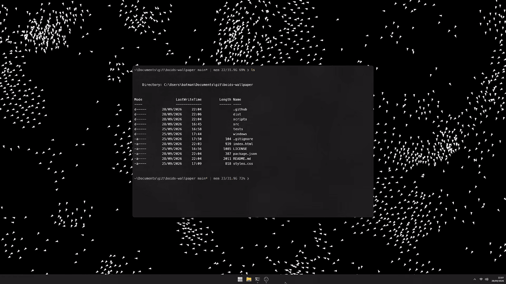

# Boids Wallpaper



A standalone **Windows desktop wallpaper**: white boids on black, behind your desktop icons. No Lively Wallpaper, browser tab, or .NET installation needed. Requires Windows 10/11 (x64) and the Microsoft Edge WebView2 Evergreen Runtime (normally installed with Edge).

## Download and run

Download `BoidsWallpaper-win-x64.zip` from [Releases](https://github.com/martinopiaggi/boids-wallpaper/releases), extract, and run `BoidsWallpaper.exe` — one self-contained file, nothing else to install. The tray icon offers **Settings**, **Pause**, **Reattach to desktop**, and **Exit**. Double-click the tray icon for settings; to quit without a tray icon, run `BoidsWallpaper.exe --exit`. It does not replace your saved Windows wallpaper and does not start automatically at login.

Settings are saved in `%LOCALAPPDATA%\BoidsWallpaper\settings.json`; startup errors go to `host.log` there. If WebView2 is missing, [install the Evergreen Runtime](https://developer.microsoft.com/en-us/microsoft-edge/webview2/). For a regular window rather than wallpaper, run `BoidsWallpaper.exe --preview`.

## Build from source

Install the [.NET 8 SDK](https://dotnet.microsoft.com/download/dotnet/8.0). From the repo root in PowerShell:

```powershell
./scripts/package-windows.ps1
```

The release-ready zip is `dist/BoidsWallpaper-win-x64.zip`, containing only `BoidsWallpaper.exe` (web assets are embedded in it). Run `npm run check` for simulation and packaging checks (Node 18+; no npm install needed). Push a `v*` tag to build and publish this zip as a GitHub Release; manual workflow runs create a downloadable CI artifact without publishing a release.

## Configuration

- **As a user**: tray icon → **Settings** for boid count, speed, fps, cursor mode, and pause rules.
- **As a developer**: all simulation defaults and tuning live in [`src/config.js`](src/config.js), one commented object. Rebuild with `./scripts/package-windows.ps1` after editing. If you change a runtime range, mirror it in the host's `Program.cs` / `DesktopApp.cs`.

The simulation is in `src/`; the WinForms/WebView2 desktop host is in `windows/Boids.Desktop/`. CPU Canvas is the fallback if WebGPU is unavailable.

[MIT license](LICENSE)
